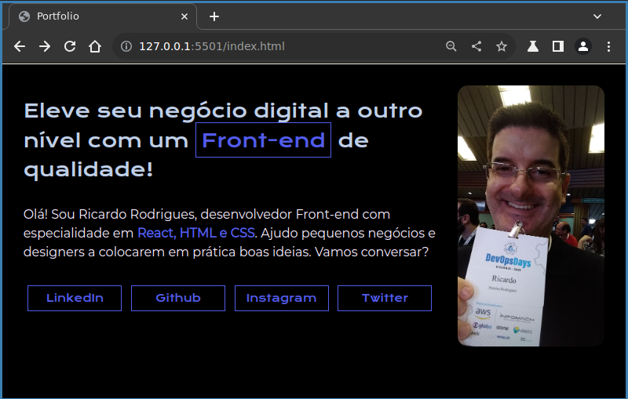

# Portfolio - 1 

Este é um projeto de portfólio desenvolvido durante o curso "Introdução ao Front-End" da Escola de Tecnologia Alura, ministrado por Guilherme Lima e Rafaella Ballerini. O portfólio é uma apresentação pessoal do "desenvolvedor" Front-end Ricardo Rodrigues e destaca suas habilidades em React, HTML e CSS.

## Estrutura do Projeto

O projeto é composto por dois arquivos principais: `index.html` e `style.css`.

### [index.html](index.html)

Este arquivo HTML é a estrutura principal da página. Ele contém:

- **Metadados:** Configurações iniciais como o conjunto de caracteres (`charset`), a viewport e o título da página.
- **Link para o CSS:** Importa o arquivo de estilo externo (`style.css`) para estilizar a página.
- **Estrutura do Conteúdo:**
  - **Header:** Seção reservada para o cabeçalho da página.
  - **Main (conteúdo):** Área principal que inclui uma seção com texto escrito e uma imagem do desenvolvedor.
  - **Footer:** Seção reservada para o rodapé da página.

### [style.css](style.css)

O arquivo CSS é responsável por estilizar a página. Ele inclui:

- **Importação de Fontes:** Importa duas fontes do Google Fonts para serem utilizadas no projeto.
- **Variáveis de Cor:** Define variáveis para as cores utilizadas ao longo do CSS.
- **Reset de Estilos:** Zera margens, preenchimentos e define a caixa de modelo como border-box para todos os elementos.
- **Estilo do Corpo da Página:** Define a cor de fundo e a cor do texto para o corpo da página.
- **Estilização de Elementos Específicos:**
  - **Strong e Span:** Especifica cores para elementos `<strong>` e ``.
  - **Classe Conteúdo:** Adiciona margem inferior e uma borda superior à seção de conteúdo.
  - **Classe Conteúdo-Principal:** Estiliza a seção principal usando flexbox para alinhamento e espaçamento.
  - **Classe Conteúdo-Principal-Escrito:** Define o layout do texto, adicionando espaçamento e uma borda.
  - **Classe Conteúdo-Principal-Imagem:** Estiliza a imagem, ajustando a altura, bordas e margens.
  - **Classe Parágrafo-Botão e Botão:** Estiliza a seção de botões e os próprios botões, definindo largura, altura, bordas, margens e cores.

## Estilização e Cores

O projeto utiliza uma paleta de cores consistente, definida no arquivo CSS através de variáveis. Essas cores são aplicadas de forma a criar uma aparência coesa e agradável à página.

O uso de diferentes fontes, como 'Krona One' e 'Montserrat', adiciona variedade e estilo ao conteúdo, proporcionando uma experiência visual interessante.

## Conclusão

Apesar de utilizar apenas HTML5 e CSS3, este projeto serve como um exemplo de habilidades de desenvolvimento Front-end, além de demonstrar boas práticas de organização de código, criando uma apresentação pessoal atraente e funcional.
